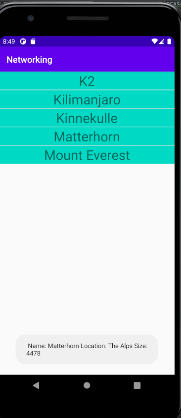

# Rapport Assignment 6: Networking

**Skriv din rapport här!**

## xml-layouts

I activity_main.xml skapas en listview med id. Den använder sig utav en constraint-layout och positioneras utifrån layoutens regler. För att sedan kunna skriva ut listerna krävs en textview. Det vill säga att
varje item i Json skrivs ut med hjälp av en textview. Viktigt att se här är att båda layouterna har ett id, vilket behövs användas senare.  Dessa två layout filerna ser ut på följande sätt:

## ListView
```xml
 <ListView
        android:layout_width="match_parent"
        android:layout_height="match_parent"
        app:layout_constraintBottom_toBottomOf="parent"
        app:layout_constraintLeft_toLeftOf="parent"
        app:layout_constraintRight_toRightOf="parent"
        app:layout_constraintTop_toTopOf="parent"
        android:id="@+id/list_item"/>
```
## TextView
```xml
 <TextView xmlns:android="http://schemas.android.com/apk/res/android"
    android:layout_width="match_parent" android:layout_height="match_parent"
    android:id="@+id/list_item_textview"
    android:textSize="30dp"
    android:gravity="center"
    android:background="@color/colorAccent">

</TextView>
```

## Skapandet av klasser
Utifrån Json-datan skapas klasser. Den första har valts att döpas till Mountain. I klassen skrivs sedan datatyperna för innehållet i Json-datan och skapar variabler med det namn som datan har namngivits med i json-
datan. Det är sedan denna vi kopplar ihop med ArrayAdaptern. För att använda sig utav en Webservice med Json-data används

```java
public class Mountain {
    private String ID;
    private String name;
    private String type;
    private String company;
    private String location;
    private String category;
    private int size;
    private int cost;
    private Auxdata auxdata;


```
För att använda sig utav en Webservice med Json-data används följande kod, denna finnes i onCreate:

```
new JsonTask().execute("LÄNK TILL JSON");
```


## Exempel på Json-data

Vilket vi kan se hänger ihop med Klassen Mountain. Auxdata består utav ett eget objekt, vilket innebär att en class har skapats för detta objektet separat. Vilket vi kan se att datatypen Auxdata används i klassen
Mountain.

```
[
    {
        ID: "mobilprog_k2",
        name: "K2",
        type: "brom",
        company: "",
        location: "The Karakoram range",
        category: "",
        size: 8611,
        cost: 28251,
        auxdata: {
                wiki: "https://en.wikipedia.org/wiki/K2",
                img: "https://upload.wikimedia.org/wikipedia/commons/thumb/1/12/K2_2006b.jpg/640px-K2_2006b.jpg"
                }
},

```


## Java onCreate & Medlemsvariabler.
En först så skapas en Medlemsvariabel i form av en ny Arraylist, denna arraylisten innehåller datatypen Mountain och döps till mountainList. Efter det skapas en ArrayAdapter även den innehållande datatypen Mountain.
I onCreate skapas sedan en listView variabel med namn listView. Listview till delas sedan layouten ifrån xml filen med ListView i. Adaptern som skapades tidigare tilldelas också ett värde. Det som skickas med in i denna
är TextViewen och arraylisten. Adaptern sätts sedan på listView variablen.
```java

public class MainActivity extends AppCompatActivity {


    private ArrayList<Mountain> mountainsList = new ArrayList<>();
    private ArrayAdapter<Mountain> adapter;

    @Override
    protected void onCreate(Bundle savedInstanceState) {
        super.onCreate(savedInstanceState);
        setContentView(R.layout.activity_main);
        ListView listView;
        listView = findViewById(R.id.list_item);
        adapter = new ArrayAdapter<Mountain>(MainActivity.this,R.layout.list_item_textview,mountainsList);
        listView.setAdapter(adapter);

```

## JsonTask & AsyncTask

används för att fetcha datan i Json. I denna klassen finns två olika funktioner en som heter doInBackground(), i denna funktionen finns informationen om det som körs i bakgrunden. Men den funktionen som har
ändrats är onPostExecute. I denan funktionen läggs information in om vad som ska göras när doInBackground är klar. Det första vi gör är att skapa en variabel med datatypen Gson. Vi skapar sedan en array
av datatypen Mountain. Denna får namnet mountains. mountains tilldelas sedan innehållet i jsonfilen. Detta genom gson.FromJson. Arraylisten mountainList clearas sedan, Vilket innebär att det inte finns något
innehåll i arraylisten. Sedan körs en for-loop i arrayen mountains. För varje berg i Arrayen så läggs ett berg till i mountainList. Vilket innebär att arraylisten kommer innehålla alla berg i Arrayen.
Sist används en adapter.notifyDataSetChanged vilken kollar ifall någon data har ändrats och datan läggs då till.

```
        protected void onPostExecute(String json) {
           
            Gson gson = new Gson();
            Mountain[] mountains;
            mountains = gson.fromJson(json,Mountain[].class);


            mountainsList.clear();
            for (int i = 0; i < mountains.length; ++i) {

                mountainsList.add(mountains[i]);
            }
            adapter.notifyDataSetChanged();


```

## OnItemClickListener

en OnItemClickListener används på ListViewen vilket innebär att om man klickar på ett item ska något hända. Detta fallet visas bergets storlek,namn och location. För att kunna använda sig utav  
getName, getSize, getLocation krävs att dessa Skapas i klassen och detta fallet har dessa skapats i klassen Mountain. Vilket innebär att man kan få ut namn size och location variablerna och dess innehåll.
Detta skrivs sedan ut i en toast. Mountain m = mountainList.get(position) hämtar vilket berg det är man klickar på. Sedan tilldelas m dessa tre funktioner, sedan skapas en string om vad som ska skrivas ut i
Toast.

```
    listView.setOnItemClickListener(new AdapterView.OnItemClickListener() {
            @Override
            public void onItemClick(AdapterView<?> parent, View view, int position, long id) {
                Mountain m = mountainsList.get(position);
                m.getName();
                m.getSize();
                m.getLocation();
                String msg = " Name: " + m.getName()  + " Location: " + m.getLocation() + " Size: " + m.getSize();

                Toast.makeText(MainActivity.this, msg , Toast.LENGTH_LONG).show();
            }
        });

```
## Bild på resultat:



